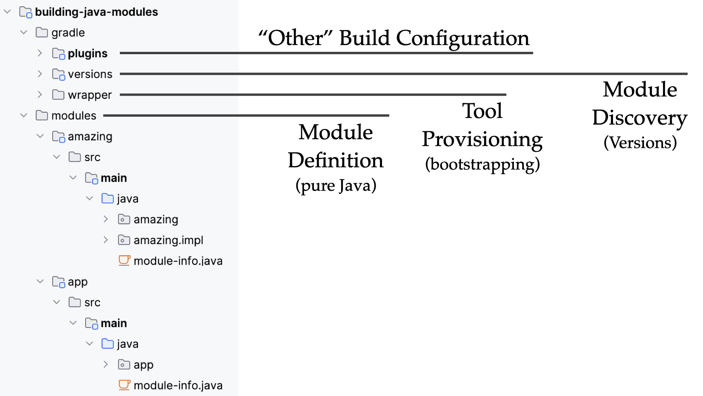

# Java Module System (with Gradle)

This is a minimalistic project that shows a structured Java project setup utilising the
[Java Module System (JPMS)](https://docs.oracle.com/javase/specs/jls/se21/html/jls-7.html#jls-7.7)
to define a modular software structure with
[Gradle](https://github.com/gradle/gradle)
as the underlying build system.
To integrate these, the 
[GradleX](https://gradlex.org/)
Java development plugins are used.

With this setup, modularization and other build configuration concerns are separated.
With that accidental complexity in the module setup is avoided.

### Learn more

- Browse slides of my 2025 talk [Combining Java Modules and Gradle for elegant project structures](docs/java-modules-and-gradle-2025.pdf) which is based on this sample
- Watch my 2024 talk [Boosting Developer Productivity Through Better Modularity](https://dpe.org/sessions/jendrik-johannes/boosting-developer-productivity-through-better-modularity)) (and [browse the slides](docs/developer-productivity-and-modularity-2024.pdf)) which uses this example
- Browse slides of my 2024 talk [Combining Java Modules and Gradle for elegant project structures](docs/java-modules-and-gradle-2024.pdf) which is based on this sample
- Browse slides of my 2023 talk [Modularizing Projects with the Java Module System and Gradle](docs/java-modules-and-gradle-2023.pdf) which gives more background on the modularity concepts in Java and Gradle
- Watch my YouTube playlist [Understanding Gradle – Java Modularity](https://www.youtube.com/playlist?list=PLWQK2ZdV4Yl092zlY7Dy1knCmi0jhTH3H) for even more information on modularity in Java and how it is handled in Gradle

### In action: projects that use this setup

- [hiero-ledger/hiero-gradle-conventions](https://github.com/hiero-ledger/hiero-gradle-conventions) use by
    - [hiero-ledger/hiero-consensus-node](https://github.com/hiero-ledger/hiero-consensus-node)
    - [hiero-ledger/hiero-sdk-java](https://github.com/hiero-ledger/hiero-sdk-java)
    - ...and other [hiero-ledger](https://github.com/hiero-ledger) projects
- [jjohannes/gradle-project-setup-howto/java_module_system](https://github.com/jjohannes/gradle-project-setup-howto/tree/java_module_system)

### Build the example

- Run `./gradlew check` to run tests and check integrity of the module setup
- To build a self-contained installable of the application, run:
  - Run `./gradlew assembleWindows-2022`
  - Run `./gradlew assembleMacos-13`
  - Run `./gradlew assembleMacos-14`
  - Run `./gradlew assembleUbuntu-22.04`

The example also builds on GitHub.
The result can be explored here:
https://github.com/jjohannes/java-module-system/actions
