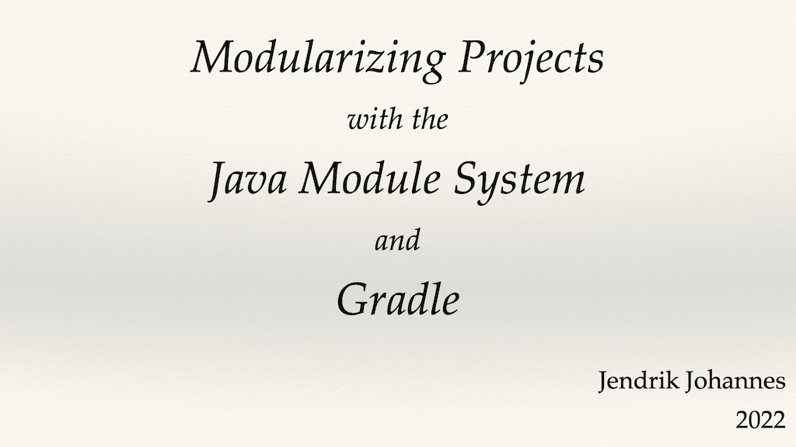

# Java Module System (with Gradle)

Slides for my talk _Modularizing Projects with the Java Module System and Gradle_

**Example project:** [java-modules-example](java-modules-example) 

Full-fledged Java Module System project setup using Gradle with the plugins below:
https://github.com/jjohannes/gradle-project-setup-howto/tree/java_module_system_pure_modules

Overview video for that project:

Understanding Gradle - Java Modularity:

If you plan to build Java Modules with Gradle, you should consider using these plugins on top of Gradle core:

- [`id("org.gradlex.java-module-dependencies")`](https://github.com/gradlex-org/java-module-dependencies)  
  Avoid duplicated dependency definitions and get your Module Path under control
- [`id("org.gradlex.java-module-testing")`](https://github.com/gradlex-org/java-module-testing)  
  Proper test setup for Java Modules
- [`id("org.gradlex.extra-java-module-info")`](https://github.com/gradlex-org/extra-java-module-info)  
  If your (existing) project cannot avoid using non-module legacy Jars
